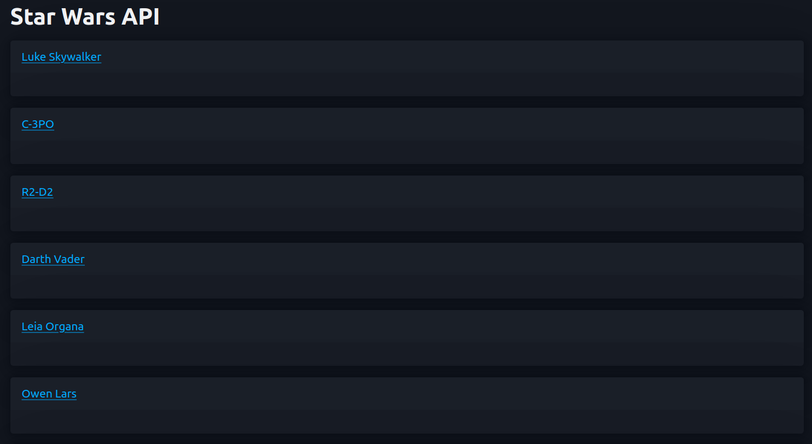
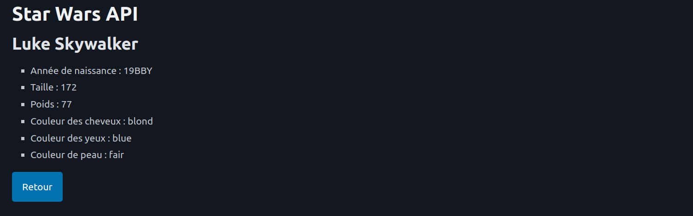

# Présentation 

Application ou l'on peut consulter les personnages de l'univers de Stars Wars grâce à l'API `SWAPI`

Au clic, on à la possibilité de ce rendre sur les caractéritiques d'un personnage, accompagné d'un bouton retour.

# Notion abordées

- Système de routing de symfony
- Création d'un controlleur
- Utilisation de l'objet `HttpClientInterface` pour communiquer et récupérer les informations depuis l'API `SWAPI`
- Création d'un service pour l'appel à l'API pour écrire la logique à l'intérieur et ainsi éviter de surcharger les controlleurs.
- Utilisation du framework Pico CSS via le CDN 

# Prérequis

- PHP 8.2
- Symfony 7
